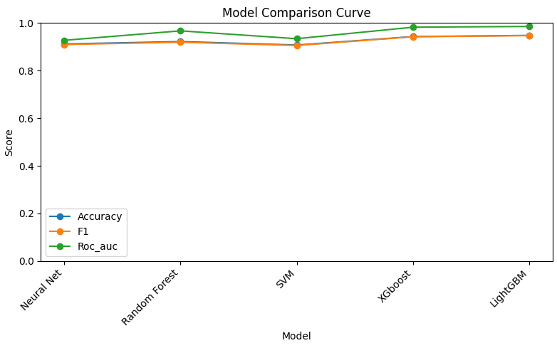
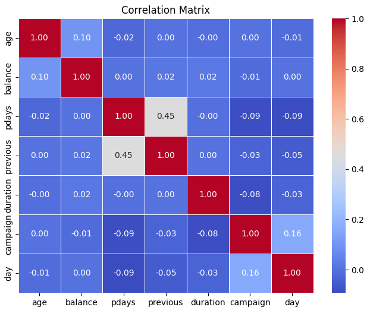
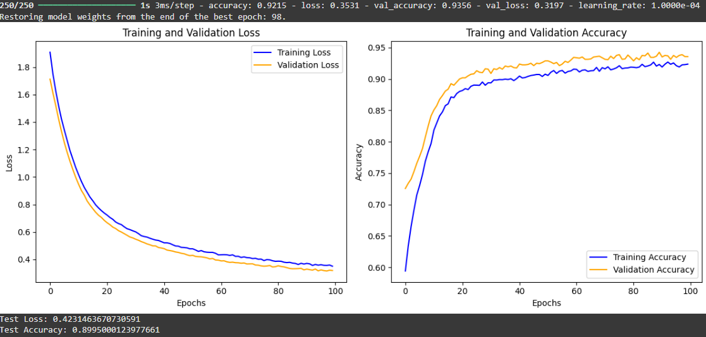
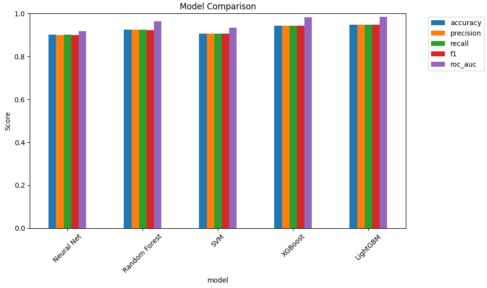

# Machine-Learning

## Project Title: Term Deposit Subscription Prediction from Telemarketing Calls

**Author:** Uday Bhaskar Voora  
**Course:** Intro to Machine Learning


---

## Project Overview

This project aims to develop a predictive model that reliably forecasts whether a bank customer will subscribe to a term deposit based on telemarketing call data. By leveraging machine learning techniques, the model helps optimize marketing campaigns by targeting clients most likely to subscribe, saving resources and improving campaign effectiveness.

---

## Motivation

Direct marketing campaigns often waste resources by contacting clients unlikely to subscribe. This project provides a data-driven approach to predict subscription likelihood, allowing banks to focus efforts strategically and enhance customer experience.

---

### Model Comparison Curve



*This line plot compares models based on Accuracy, F1 Score, and ROC AUC. LightGBM and XGBoost consistently outperform other models, showing near-perfect metrics.*

---

## Dataset

- Source: Portuguese Banking Dataset  
- Data Description: Customer demographics, campaign details, and subscription outcomes.  
- Size: ~45,000 records with various categorical and numerical features.  
- Target variable: `y` (1 if subscribed, 0 otherwise).

---

## Methodology

### Data Preprocessing
- Handled categorical variables using binary, ordinal, and one-hot encoding.
- Scaled numerical features using MinMaxScaler.
- Balanced the dataset using SMOTE oversampling and random undersampling to address class imbalance.

### Model Selection
Evaluated multiple classifiers:
- Logistic Regression
- Decision Tree
- Random Forest
- Support Vector Machine (SVM)
- Neural Network
- TabNet (deep learning for tabular data)
- XGBoost
- LightGBM

### Hyperparameter Tuning
- Used GridSearchCV and RandomizedSearchCV to find optimal parameters for each model.

---

## Results

| Model           | Accuracy | Precision | Recall  |
|-----------------|----------|-----------|---------|
| LightGBM        | 0.951    | 0.951     | 0.951   |
| XGBoost         | 0.949    | 0.949     | 0.949   |
| Random Forest   | 0.938    | 0.939     | 0.938   |
| Neural Network  | 0.924    | 0.924     | 0.924   |
| SVM             | 0.923    | 0.923     | 0.923   |
| TabNet          | 0.900    | 0.910     | 0.970   |

*LightGBM and XGBoost showed the best overall performance, balancing precision and recall effectively.*

---

## Visualizations

### Correlation Matrix



*This heatmap displays the correlation coefficients between key numerical features. It highlights relationships such as a moderate positive correlation between `pdays` and `previous`, indicating clients contacted previously are more likely to be contacted again.*

---

### Neural Network Training and Validation Curves



*These plots illustrate the neural network’s training progress. The loss graph shows both training and validation loss decreasing steadily, while the accuracy graph demonstrates improvements in both training and validation accuracy, indicating good model learning and generalization.*

---

### Model Comparison Curve


*This line plot compares models based on Accuracy, F1 Score, and ROC AUC. LightGBM and XGBoost consistently outperform other models, showing near-perfect metrics.*

---

### Model Comparison Bar Chart



*This grouped bar chart compares the performance of different models across several metrics including accuracy, precision, recall, F1 score, and ROC AUC. XGBoost and LightGBM show the best overall performance.*

---

## Conclusions

- LightGBM demonstrated superior performance in accurately predicting term deposit subscriptions.
- Balancing precision and recall is critical to optimize marketing efforts, minimizing wasted resources while maximizing campaign reach.
- The project highlights the value of machine learning to improve direct marketing efficiency in the banking sector.

---

## How to Run

1. Clone the repository.
2. Install dependencies:  
   ```bash
   pip install -r requirements.txt


